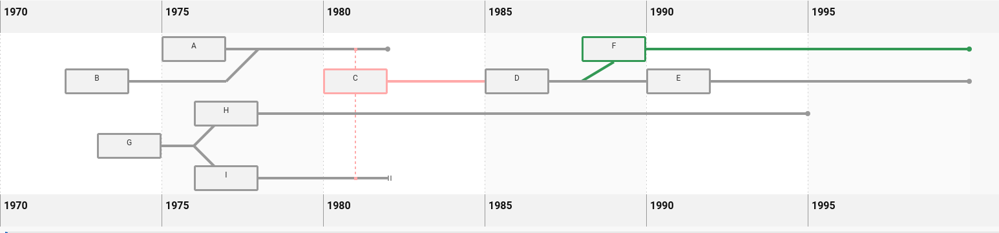

This module draws a timeline diagram, using SVGs to link entries.

It was originally created to illustrate the development of left-wing political organisations in Ireland, as part of the Irish Left Archive. For a full-featured live example demonstrating the features documented below, visit the [Timeline of the Irish Left](https://www.leftarchive.ie/page/timeline-of-the-irish-left/).

<a name="use" />

Basic Use
---

To use the timeline:

* Include timeline.min.js and timeline.min.css in your document.
* Add a div with ID "diagram" to your HTML.
* Add your timeline entries as `<div>` elements within div#diagram, with the appropriate `data-` attributes (see **HTML data attributes** below).
* Instantiate a new Timeline in JS, and call the create() method on it.

Simple example including some configuration options, and a mixture of automatic and manual row positioning:

```html

<div id="diagram">
	<div id="A" data-start="1975" data-end="1982">A</div>
	<div id="B" data-start="1972" data-merge="A" data-end="1978">B</div>
	<div id="C" data-start="1980" data-links="A I" data-colour="#faa" data-become="D">C</div>
	<div id="D" data-start="1985" data-become="E">D</div>
	<div id="E" data-start="1990" >E</div>
	<div id="F" data-start="1988" data-split="D" data-colour="#395">F</div>
	<div id="G" data-start="1973" data-row="3" data-fork="H I">G</div>
	<div id="H" data-start="1976" data-end="1995">H</div>
	<div id="I" data-start="1976" data-row="4" data-end="1982" data-end-estimate="true">I</div>
</div>
```

```javascript

const example = new Timeline("diagram", { 
	yearStart: 1970,
	yearEnd: 2000
});
example.create();
```

This is rendered as below:



Javascript modules
---

The script is bundled as an ES6 module (dist/timeline.esm.js) or a UMD (dist/timeline.min.js), depending on your prefered development stack/build tools.

HTML data attributes
---

Each entry in your timeline is placed within the #diagram div (by default, these are `<div>` elements).

**Each entry must have a unique ID**.

The following data attributes then determine the position and connections of the entry.

|Attribute	|Required	|Value	|Use	|
|-----------|-----------|-------|-------|
|data-start|Yes|`<number>` A year|The year the entry starts at in the timeline|
|data-end|No|`<number>` A year|The year the entry ends. If omitted, this will be determined either by other connections, or if there are none, it will continue to the end of the timeline|
|data-row|No|`<number>`| *Note: The first row is '0'*. <br />The row number this entry should appear in. This can be omitted, though automatic positioning is quite basic. It is recommended to use manual positioning or a combination of both for large or complex diagrams (see [Entry Positioning](#entry-positioning) below).|
|data-end-estimate|No|true or false|Whether the end is an estimate. Estimated end times are shown with a dashed end to the line, instead of a point.|
|data-become|No|Another entry ID|The entry 'becomes' another entry. I.e. another entry is the continuation of this entry, and it will be drawn on the same line.  For example, use this when an entry changes its name.|
|data-split|No|Another entry ID|If specified, the entry will be shown branching from the specified entry, at the year specified in 'data-start'.|
|data-merge|No|Another entry ID|If specified, the entry will be connected to the specified entry, at the year specified in 'data-end'.|
|data-fork|No|Two space-separated entry IDs|If specified, the entry line will be forked at the year specified by 'data-end' and connected to the two entries specified. |
|data-links|No|A space-separated list of entry IDs|If specified, the entry is linked with a dashed line to each entry ID. Useful for looser associations between entries that should not be connected directly.|
|data-colour|No|A CSS colour hex|The colour of the border around the entry and connections from it. |
|data-irregular|No|true or false|Set to true for entries that are 'irregular' or should not be unbroken from their start to end dates. If set to true, the entry will be drawn with a broken line.|


<a name="panzoom" />

Panning and Zooming
---

For large diagrams, Timeline can make use of [@panzoom/panzoom](https://github.com/timmywil/panzoom) to add panning and zooming to the diagram within a fixed container. Include @panzoom/panzoom in your dependencies (it is not bundled), and pass 'panzoom: true' in the config when instantiating the timeline (see [Javascript Options](#javascript) below).

<a name="controls_search" />

Controls and searching
---

If Panzoom is active, controls can be added to find an entry and pan to it, and also to control the zoom.

**Find an Entry**

Include a form with the id "timeline-find" (by default - this is configurable) containing an input with the name "finder".
The input will then provide an autocomplete list of the entries in the diagram, which, when selected, will trigger the diagram to pan to that entry and highlight it.

**Zoom controls**

Buttons can be added to control 'zoom in', 'zoom out' and 'reset zoom' with specified IDs.  If not specified in the configuration, the zoom actions are attached to these IDs, if present in the document: 'timeline-zoom-in', 'timeline-zoom-out', 'timeline-zoom-reset'.

**Finding on load with URL hash**

If a URL hash is present on load and Panzoom is enabled, the timeline will pan to and highlight a given entry automatically if the hash is in the format '#find-{id}'.

**Example**

An example putting these together as a controls div within the diagram.

The provided classes will position the controls in a box in the bottom right corner of the timeline container.

```html
<div class="controls">
	<form id="timeline-find">
			<input type="text" name="finder" 
				placeholder="Type to find an entry" aria-label="Find an entry" />
	</form>
	<div class="zoom-buttons" role="group" aria-label="Diagram Zoom Controls">
		<button id="timeline-zoom-out" type="button">Zoom Out</button>
		<button id="timeline-zoom-reset" type="button">Reset</button>
		<button id="timeline-zoom-in" type="button">Zoom In</button>
	</div>
</div>

```

<a name="javascript" />

Javascript Options
---

The main Timeline class is documented below.  Note that configuration is optional - any or none of these options can be passed in the config object. If specifying a config, you must also pass the container ID as the first parameter when creating the timeline.

### Timeline
The class representing the Timeline.  This is the point of access to this tool.
The simplest usage is to instantiate a new Timeline object, and then call the create() method.

**Kind**: global class  

* Timeline
    * [new Timeline([container], [config])](#new_Timeline_new)
    * [.create()](#Timeline+create)
    * [.panToEntry(id)](#Timeline+panToEntry)
    * ["timelineFind"](#Timeline+event_timelineFind)

<a name="new_Timeline_new"></a>

### new Timeline([container], [config])

| Param | Type | Default | Description |
| --- | --- | --- | --- |
| [container] | <code>string</code> | <code>&quot;diagram&quot;</code> | The ID of the container element for the timeline |
| [config] | <code>object</code> |  | All config for the timeline |
| [config.panzoom] | <code>boolean</code> | <code>false</code> | Whether to apply panning and zooming feature to the timeline |
| [config.findForm] | <code>string</code> | <code>&quot;timeline-find&quot;</code> | The ID of the find form |
| [config.zoomIn] | <code>string</code> | <code>&quot;timeline-zoom-in&quot;</code> | The ID of the button to zoom in |
| [config.zoomOut] | <code>string</code> | <code>&quot;timeline-zoom-out&quot;</code> | The ID of the button to zoom out |
| [config.zoomReset] | <code>string</code> | <code>&quot;timeline-zoom-reset&quot;</code> | The ID of the button to reset the zoom level |
| [config.yearStart] | <code>number</code> | <code>1900</code> | the starting year for the timeline |
| [config.yearEnd] | <code>number</code> | <code>Current year + 1</code> | the end year for the timeline |
| [config.strokeWidth] | <code>number</code> | <code>4</code> | the width in px of the joining lines |
| [config.yearWidth] | <code>number</code> | <code>50</code> | the width in px of diagram used for each year |
| [config.rowHeight] | <code>number</code> | <code>50</code> | the height in px of each diagram row |
| [config.padding] | <code>number</code> | <code>5</code> | the padding in px between rows |
| [config.strokeColour] | <code>string</code> | <code>&quot;#999&quot;</code> | the default colour for lines drawn (must be a valid colour hex) |
| [config.boxWidth] | <code>number</code> | <code>100</code> | the width in px of each entry |
| [config.guides] | <code>boolean</code> | <code>true</code> | whether to draw striped guides at regular intervals in the timeline |
| [config.guideInterval] | <code>number</code> | <code>5</code> | the interval in years between guides (ignored if 'guides' is false) |
| [config.entrySelector] | <code>string</code> | <code>&quot;div&quot;</code> | the CSS selector used for entries |
| [config.linkDashes] | <code>string</code> | <code>4</code> | The svg dasharray for link lines. (Must be a valid dasharray - see <https://developer.mozilla.org/en-US/docs/Web/SVG/Attribute/stroke-dasharray>) |
| [config.irregularDashes] | <code>string</code> | <code>88 4 4 4</code> |  The svg dasharray for entries marked as 'irregular' with the data-irregular attribute. (Must be a valid dasharray - see <https://developer.mozilla.org/en-US/docs/Web/SVG/Attribute/stroke-dasharray>) |

<a name="Timeline+create"></a>

### timeline.create()
Create the Timeline. This should be called after instantiation.

**Kind**: instance method of [<code>Timeline</code>](#Timeline)  
<a name="Timeline+panToEntry"></a>

### timeline.panToEntry(id)
If Panzoom is enabled, pan to the element with the given ID, and reset the zoom.

**Kind**: instance method of [<code>Timeline</code>](#Timeline)  
**Emits**: [<code>timelineFind</code>](#Timeline+event_timelineFind)  

| Param | Type | Description |
| --- | --- | --- |
| id | <code>string</code> | The ID of a timeline entry |

<a name="Timeline+event_timelineFind"></a>

### "timelineFind"
timelineFind event.

**Kind**: event emitted by [<code>Timeline</code>](#Timeline)  
**Properties**

| Name | Type | Description |
| --- | --- | --- |
| details | <code>object</code> |  |
| details.id | <code>string</code> | the ID of the entry |
| details.name | <code>string</code> | the name of the entry |


<a name="entry-positioning" />

Entry Positioning
---

The X axis position of each entry must be manually set by specifing the 'data-start' attribute.  The extent of the entry along the timeline is determined either by the 'data-end' attribute, or extends to the end of the timeline.

Specifying the row manually for each entry is not required. However, only some basic tests are performed to choose a suitable row for each entry when it is not specified, so aside from simple examples, it is recommended to manually set 'data-row' at least on a proportion of entries and those with complex links to ensure a sensible layout.

The row is determined in source-code order for each entry if it is omitted. A row is determined as follows:

* Available space, starting from the first row until a space is found.
* Connected entries (via 'data-becomes' attribute) must be on the same row.
* Split, merge, and fork entries should aim to be as close to their linked entries as possible, depending on nearest available row with space.

Licence
---

Copyright (C) 2021 Aonghus Storey

This program is free software: you can redistribute it and/or modify
it under the terms of the GNU General Public License as published by
the Free Software Foundation, either version 3 of the License, or
(at your option) any later version.

This program is distributed in the hope that it will be useful,
but WITHOUT ANY WARRANTY; without even the implied warranty of
MERCHANTABILITY or FITNESS FOR A PARTICULAR PURPOSE.  See the
GNU General Public License for more details.

See the [`LICENCE`](LICENCE) file for details.
